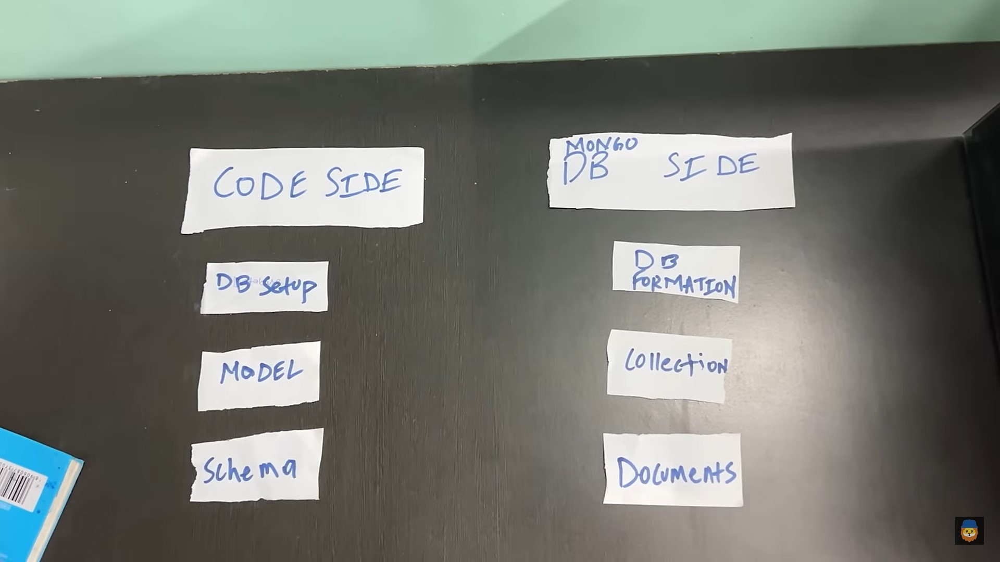

//install

when we download any .exe app and installation is done in specific location it will copy the files from web to our machine.

install -> copy files in our laptop/computer/tablet

//node js

node js is the lots of code of C++ which is taken from v8 engine which is present inside chrome browser and this code is wrap with js code. It allows us to write js code and it accepts js code. On the basis of C++  it will create a server environment. This code will only run until node(v8 engine and js wrapper) is running.
nodejs = (v8 engine) 
In this () is js wrapper
v8 engine => main code is present inside chrome browser. It provides a runtime environment for execution

//import and export in js

module.exports=variable name;
var data=require("./path");

//npm => Nahi Pata Mujhe
//npm = Collection of packages 
package = files of code
https://www.npmjs.com/

install
use
how to print results

//express js

express framework for nodejs
express use case => routing
routing => GET POST
https://www.facebook.com
route => /profile
/profile = profile
/contact = contact

Take an example of google search. when we search something on google in url it will show the data. This is happening because of GET route.

Now take an example of facebook. when we try to login using username and password the data will be secured it will be not in url. This is happening because of POST route.

When we search some website we are redirected to / route
https://www.microsoft.com => https://www.microsoft.com/

install express package

npm i express

for continuously running the server when we make change's we don't have to restart the server

npm i nodemon -g //for global
npm i nodemon //for that specfic package
npx nodemon filename.js

//middleware

It is a function which will run before running any route. That means before running any route if you want to do something we use middleware at that moment.

Only one issue we get when we use middleware the request get jam and we didn't reach to the route
for solving that issue we use next()

app.use(function(req, res, next){
    console.log("hello from middleware");
    next();
});

Because of HTTP we are able to make a server

//node vs express
node is the main thing. With the help of express code we write server code and how the server will react this also we write with the help of express.
if express is not their we can write code in node but it will be lengthy. We write code in express so that our life gets easier. Behind the scene express uses
node code only. That means if node is not their express will also not their but if node is their and express is not their then it's ok. Take an example of default 
browser on the phone. We rarely used that browser but we are able to use different browser which is suitable for us.

//what is express js
It is a package and mainly used for routing

//why express js
http is difficult to use, express makes this easier

//routing
the process of making routes is called routing
/profile
/home

//middleware

app.use(function(req, res, next){
    res.send("hello from middleware");
    next();
});

//req
the data of the user who is sending the request
req contains all the data coming from the user who is sending the request just like location, device info and other things
//res
server is sending the response to the user
res contains controls on that basis server sends the response
//next
next is just a push so that our request moves to the next thing which should be executed

//dynamic routing
That route whose some part is always same and some part always change

//route parameters
to make any route dynamic you can use : at the place where you want to make it dynamic, and to access there value use req.params

/author/books/issued/harsh
/author/books/issued/vivek

/author/books/issued/:username

//templates engines => this is style of markup which converts it into html
Ex. of TE => pug, handlebars, ejs, jade
pug & jade syntax looks like python
ejs syntax looks like html

//What is EJS?

What is the "E" for? "Embedded?" Could be. How about "Effective," "Elegant," or just "Easy"? EJS is a simple templating language that lets you generate HTML markup with plain JavaScript. No religiousness about how to organize things. No reinvention of iteration and control-flow. It's just plain JavaScript. It is exact duplicate of html.

html doesn't have superpowers to calculate the numbers
if we write 1+1 in html it will give us 1+1 only
ejs is advance version of html with superpowers which can do javascript inside html
Just like in react we have jsx here we have ejs

//setup of ejs

->ejs install
npm i ejs

->configue ejs
app.set('view engine', 'ejs);

->make folder with the name of views

->inside that make ejs files

->instead of send put render => at the time of render make sure to use the file that is ejs file which is present inside views folder and inside render function don't mention ejs

//static files
To setup images, stylesheets, frontend js

//Steps to setup static files
-> create a folder called public

-> create three folders inside it, images,stylesheets, javascripts

-> configure the express static 

-> understand the path

//error handling
https://expressjs.com/en/guide/error-handling.html

put error function inside
app.use()

// express generator
we were wasting our time for settting up the express and creating the project structure. But with the help of express generator it is easy. It will make the folder structure for you and it will write the basic code for the project.
It will give us the folder readymade just like our project (backend) that means we didn't have to create. All the files of express will be inside in this folder.

// steps to use express generator
first of all install it globally
-> npm i express-generator -g

// to create new app anywhere
-> open cmd move to your destination
-> create new app : 
   express appname --view=ejs

// now use two commands
-> cd appname
-> npm i
-> open in vscode

// changes happen 
-> app.get -> router.get
-> npx nodomon filename => npx nodemon

//Database -> a place where the data of app get stored
//Two types of DB 
-> Relational DB (Mysql)
-> Non-relational DB (MongoDB)

// The data of the new app will be always stored in storage, but it will not be stored directly but it is placed inside a container. Inside that container, only the app data will be there

// MongoDB
-> dbs, models, schema, collections, documents

// models (code) => collection (db)

// schema (code) => documents (db)

// The data of one app => db
// Inside that app variety of data will be there but whole data is of app. But inside that data sub category will be there that is called collection.
// collection means data of users, data of products, but only data of one user, one product is called document

// install mongoosejs
-> npm i mongoose

// require and setup connection
-> const mongoose = require("mongoose")
-> mongoose.connect("mongodb://127.0.0.1:27017/db_name")

// make schema
-> const userschema = mongoose.Schema({
    username: String,
    name: String,
    age: Number
})

// create model and export
-> mongoose.model(model_name, schema);

   client            server
  (browser)         (nodejs)
   cookies           session

// If we want to store the data in frontend it will done with the help of cookies.
// If we want to store the data on server side it will done with the help of session.

// setup of sessions
-> npm i express-session

// Inside app.js create variable 
-> var session = require("express-session");
// Then we have to use that session
// app.use(session({
    resave: false,  // if the value of session is not     change then don't change the value

    saveUninitialized: false, // if the data is unknown then don't save the data

    secret: "yoyo"
}));
// Inside index.js file we can make any session and set any value for it and it will stored inside the server

//create
-> req.session.hello = "world"

// read
-> req.session.hello;

// delete
-> req.session.destroy()

// setup of cookies
It is already installed by express generator know as cookie-parser

// create
-> req.cookie("name", value)

// read
-> req.cookies.cookie_name

// delete
-> res.clearCookie("name")

// flash messages
-> when you see some ejs page and in that if you want to give some info, that is called flash messages, they are more like good looking alerts, warning and descriptions

// setup of flash
-> install connect-flash
-> make sure to setup express-session
-> make sure to put connect flash in a app.use fnc
-> in any route you have to create flash
-> in any other route you have to run app 

** You can't use connect flash without express session

// flash message means you can send any data from one route to another route

